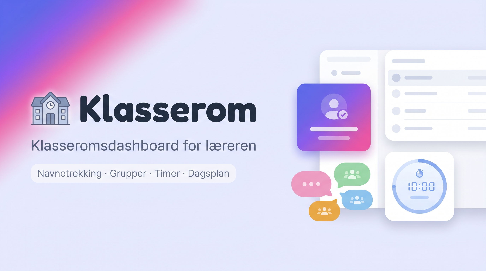

# 🏫 Klasserom-dashboard

Et digitalt klasseromsdashboard for lærere — navnetrekning, gruppeinndeling, timer, dagsplan og mer, rett i nettleseren. Ingen innlogging, ingen installasjon, ingenting sendes til en server.

**👉 Prøv den her: [knitresletta.github.io/klasserom-dashboard](https://knitresletta.github.io/klasserom-dashboard/)**



## Widgets

| Widget | Hva den gjør |
|---|---|
| **Elever** | Elevliste med tilstedeværelse og lagrede klasselister |
| **Grupper** | Tilfeldig gruppeinndeling — med begrensninger for hvem som ikke bør havne sammen |
| **🎲 Tilfeldig elev** | Trekk en tilfeldig elev, med eller uten repetisjon (backlog) |
| **⭐ Ordenselever** | Trekk to ordenselever — alle får før noen får igjen |
| **Klassebamse** | Trekk hvem som tar med klassebamsen hjem (bamsen kan hete hva som helst) |
| **⏱ Timer** | Nedtelling med fremdriftslinje — fortsetter selv om du bytter side |
| **📋 Dagsplan** | Dagens punkter — marker ferdig, dra for å endre rekkefølge |
| **Notat** | Fritekstkort — legg til så mange du vil |
| **Bilde** | Bildekort med bilder opptil 50 MB (lagres i IndexedDB) |
| **▶️ YouTube** | Spill video i kortet, eller bytt til 🎵 kun lyd med volumkontroll |

## Sider og tilpasning

- **Én side per klasse:** hver side har egen elevliste, grupper, dagsplan og trekk-historikk. Gi fanene egne navn (f.eks. «1A», «Mattegruppe») og bytt fritt mellom dem.
- **Fleksibel layout:** 1–4 kolonner med justerbar bredde, dra-og-slipp av kort, og en ⊞ Widgets-meny der du henter fram akkurat de kortene du trenger.
- **Utseende:** flere temaer (lys, mørk, På fjellet, I eventyrland, Equestria), valgfri font og skriftstørrelse.
- **Hurtigtaster:** de vanligste handlingene har egne taster — se baren nederst i appen.

## Lagring og personvern

Alt lagres lokalt i nettleseren din (localStorage + IndexedDB). Ingen elevdata forlater maskinen.

Bruk **📤 Eksporter data** for å ta backup av alt — klasselister, sider, innstillinger, notater og bilder — til én fil, og **📥 Importer data** for å hente det tilbake eller dele klasselister med en kollega. Et lite varsel minner deg på å eksportere når du har ulagrede endringer.

## Kjør lokalt

Ingen byggesteg — appen er én HTML-fil, én CSS-fil og én JS-fil.

```bash
# Enkleste vei: åpne index.html direkte i nettleseren.

# Anbefalt for testing (IndexedDB krever secure context i enkelte nettlesere,
# og serveren skrur av caching så du alltid ser nyeste versjon):
python3 serve.py          # http://localhost:8000
python3 serve.py 5500     # egen port

# Syntaks-sjekk av JS uten å kjøre appen:
node --check app.js
```

## Tilbakemeldinger

Funnet en feil, eller savner du noe? Åpne gjerne et [issue](https://github.com/Knitresletta/klasserom-dashboard/issues) — eller bruk 💬 Tilbakemelding-knappen i appen.
